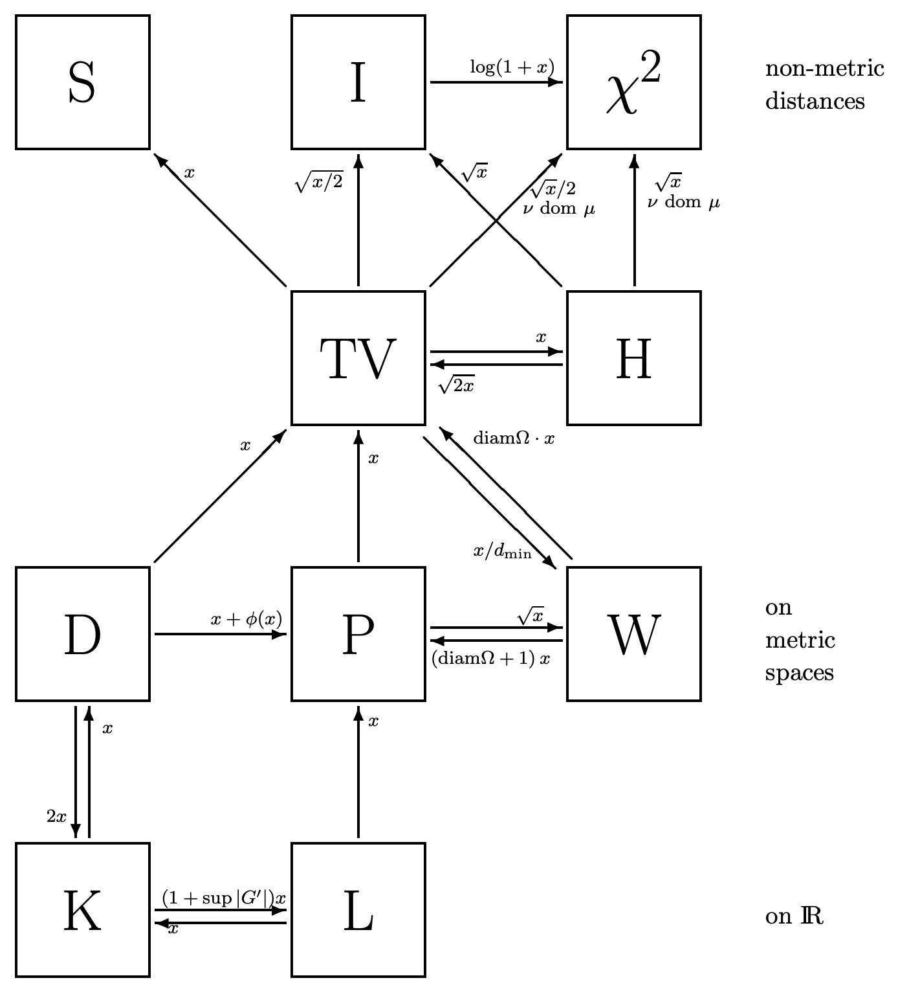
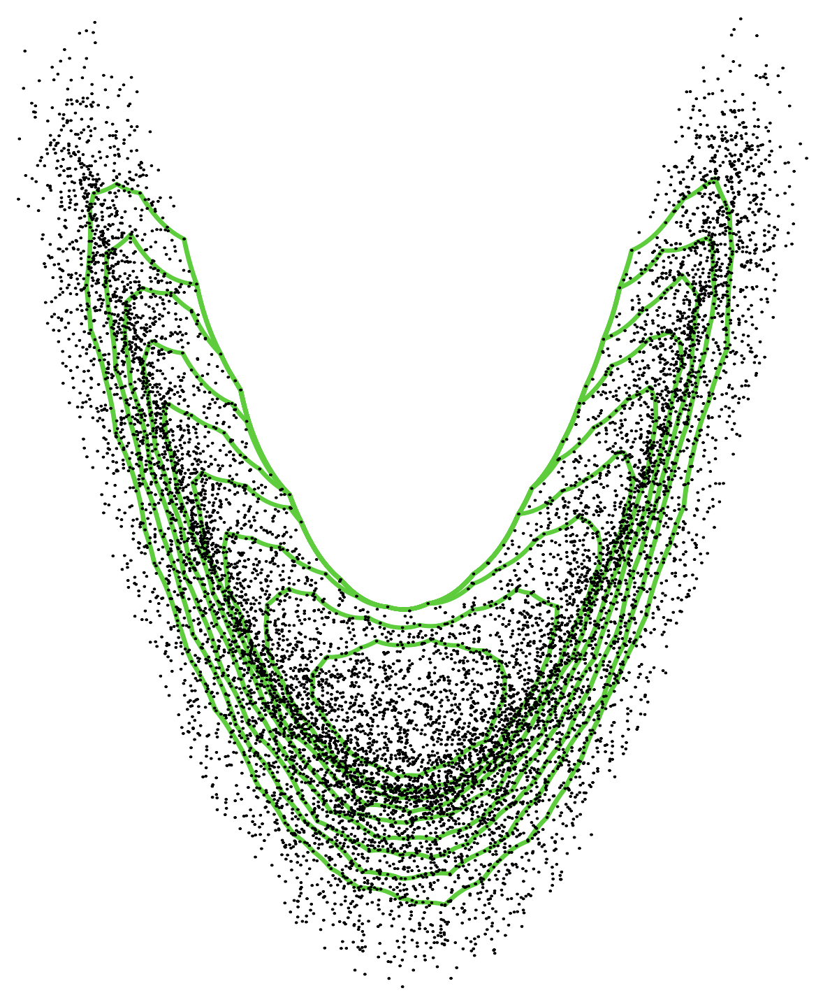

At UC Berkeley's [Center for Targeted Machine Learning and Causal Inference](https://ctml.berkeley.edu/), our **OTMLE** (**O**ptimal Transport and **T**argeted **M**aximum **L**ikelihood **E**stimation) reading group explores the intersection of optimal transport theory and TMLE, offering a fresh perspective on how TMLE fluctuations of probability measures can be understood. The group covers key topics, including _history of optimal transport_, _Wasserstein metrics_, _geodesics_, _gradient flows_, _statistical estimation_, and _information geometry_. Each session focuses on one of these themes, providing participants with a comprehensive foundation to bridge optimal transport with statistical estimation techniques in TMLE.

We invite _all_ enthusiasts, researchers, and practitioners—regardless of affiliation with the CTML—to join our reading group sessions. Your interest and contributions are highly valued, as we believe that a diverse community fosters richer discussions and deeper understanding. Whether you're new to the field or have extensive experience, we welcome you to be part of our collaborative exploration of optimal transport and TMLE.

To stay informed about our reading group sessions and the latest developments at the CTML, we invite you to subscribe to both our [reading group's mailing list](https://forms.gle/bg4UQBNcc1rHEr6p6) and the [CTML newsletter](https://berkeley.us21.list-manage.com/subscribe?u=2abb346cb31a2e829e779ecbb&id=c7203ec4f3). Joining these mailing lists ensures you receive timely updates on meeting schedules, discussion topics, and upcoming events.

# References

Our weekly reading materials will be drawn from the following list, though it is not exhaustive. We have carefully hand-picked these resources to offer not only a comprehensive introduction to optimal transport theories but also to emphasize aspects that are potentially useful in relation to TMLE.

- **Agueh, M., & Carlier, G. (2011). Barycenters in the Wasserstein space. _SIAM Journal on Mathematical Analysis, 43_(2), 904-924.**
- **Agueh, M., & Carlier, G. (2017). Vers un théorème de la limite centrale dans l'espace de Wasserstein?. _Comptes Rendus. Mathématique_, 355(7), 812-818.**
- **Ambrosio, L., Gigli, N., & Savaré, G. (2008). _Gradient flows: in metric spaces and in the space of probability measures._ Springer Science & Business Media.**
- **Chernozhukov, V., Galichon, A., Hallin, M., & Henry, M. (2017). Monge–Kantorovich depth, quantiles, ranks and signs.**
- **Figalli, A., & Glaudo, F. (2021). _An invitation to optimal transport, Wasserstein distances, and gradient flows._**
- **Gibbs, A. L., & Su, F. E. (2002). On choosing and bounding probability metrics. _International statistical review, 70_(3), 419-435.**
- **Panaretos, V. M., & Zemel, Y. (2019). Statistical aspects of Wasserstein distances. _Annual review of statistics and its application, 6_(1), 405-431.**
- **Panaretos, V. M., & Zemel, Y. (2020). _An invitation to statistics in Wasserstein space_ (p. 147). Springer Nature.**
- **Peyré, G., & Cuturi, M. (2019). Computational optimal transport: With applications to data science. _Foundations and Trends® in Machine Learning, 11_(5-6), 355-607.**
- **Santambrogio, F. (2015). Optimal transport for applied mathematicians. _Birkäuser, NY_, 55(58-63), 94.**
- **Tsybakov, A. B. (2009). Lower bounds on the minimax risk. _Introduction to Nonparametric Estimation_, 77-135.**
- **Villani, C. (2009). _Optimal transport: old and new_ (Vol. 338, p. 23). Berlin: springer.**
- **Villani, C. (2021). _Topics in optimal transportation_ (Vol. 58). American Mathematical Soc..**
- **Wainwright, M. J. (2019). High-dimensional statistics: A non-asymptotic viewpoint (Vol. 48). Cambridge university press.**

## [Introduction]
> **Date**: September 25th, 2024
>
> **Presenter**: Kaiwen Hou
>
> **Optional Reading**: Villani (2021) Sections 0.1-0.3, 2.1-2.3.1
*   Purpose of the reading group and its role in advancing targeted learning
*   Logistics: meeting times, room assignments, and reading materials for the semester
*   Basic concepts: source measure, target measure, transport map, and pushforward
*   Monge's formulation, existence, and uniqueness
*   Kantorovich's relaxation and transport plan
*   Property of the optimal transport map: monotonicity
*   Optimal transport map implied by TMLE
>
> **Unresolved Questions**:
*   Compactness of the coupling space
*   Weierstrass theorem: existence in Kantorovich's formulation
*   Existence of suboptimal transport plan in proving monotonicty

## [Geometry of Optimal Transport]
> **Date**: October 2nd, 2024
>
> **Presenter**: Kaiwen Hou
>
> **Reading**: Villani (2021) Sections 2.2-2.3.2, 1.1.1-1.1.5; Santambrogio (2015) Box 1.1, Theorem 1.4
>
> **Optional Reading**: Villani (2021) Sections 4.1, 1.1.6-1.2, 2.1.1-2.1.3; Santambrogio (2015) Section 1.2
*   Construction of optimal transport map
*   Cyclical monotonicity and Rockafellar's theorem
*   Monge–Ampère equation
*   Existence of optimal transport plan in Kantorovich's formulation

## [Wasserstein Distances]
> **Date**: October 9th, 2024
>
> **Presenter**: [Qiuran Lyu](https://lqrrrrr.github.io/)
>
> **Reading**: Villani (2021) Sections 7.1, 7.4, Exercise 7.11
>
> **Optional Reading**: Villani (2021) Sections 7.2-7.3; [Engquist, Froese & Yang (2016)](https://arxiv.org/pdf/1602.01540) Theorem 5
*   Wasserstein metric: nonnegativity and symmetry
*   Gluing lemma to prove the triangle inequality
*   Proof of gluing lemma
*   Ordering and interpolation inequalities
*   Topological properties: robustness to oscillations
*   Convexity properties and behavior under rescaled convolution

## [Statistical Inference Based on Wasserstein Distances]
> **Date**: October 16th, 2024
>
> **Presenter**: [Wenxin Zhang](https://ctml.berkeley.edu/people/wenxin-zhang)
>
> **Reading**: Villani (2021) Sections 2.1.5, 5.1.3; [Agueh & Carlier (2011)](https://hal.science/hal-00637399/document) Sections 1-3, 6; [Panaretos & Zemel (2019)](https://arxiv.org/pdf/1806.05500) Sections 2.1, 3.1
>
> **Optional Reading**: Villani (2021) Sections 5.2.1-5.2.2; Santambrogio (2015) Lemma 5.29, Proposition 5.32; [Agueh & Carlier (2017)](https://www.sciencedirect.com/science/article/pii/S1631073X17301528); Panaretos & Zemel (2020)

*   Properties of Wasserstein distances under shifts, scaling, and product measures
*   Subadditivity of Wasserstein distances w.r.t. convolutions
*   Wasserstein test statistics for empirical measures and/or two samples
*   Asymptotic distributions of Wasserstein test statistics under univariate measures
*   Wasserstein Fréchet mean of univariate location family: sufficient condition
*   Wasserstein Fréchet mean of two measures: displacement interpolation
*   Wasserstein Fréchet mean of Gaussian distributions is Gaussian

## [Ten Metrics on Probability Measures]
> **Date**: October 23rd, 2024
>
> **Presenter**: [Qiuran Lyu](https://lqrrrrr.github.io/)
>
> **Reading**: [Gibbs & Su (2002)](https://arxiv.org/pdf/math/0209021) Figure 1, Sections 2-3
>
> **Optional Reading**: [Peyré & Cuturi (2019)](https://arxiv.org/pdf/1803.00567) Sections 8.1-8.4; Tsybakov (2009) Section 2.4; Wainwright (2019) Chapter 15

*   Definitions
*   f-divergence
*   Metric inequalities and [proof](./notes/metric_inequalities.pdf)

## [Monge–Kantorovich Depth]
> **Date**: October 30th, 2024
>
> **Presenter**: [Yilong Hou](https://statistics.berkeley.edu/people/yilong-hou)
>
> **Reading**: Villani (2021) Proposition 2.4, Theorem 2.9; [Chernozhukov et al. (2017)](https://arxiv.org/pdf/1412.8434) Paragraphs "Notation, conventions and preliminaries", "MK depth is halfspace depth in dimension 1", Sections 2.3, 3.2-3.3, A, B3-4
>
> **Optional Reading**: [Duality and double convexification](./notes/double_convexification.pdf) (scribed by [Qiuran Lyu](https://lqrrrrr.github.io/))

*   Statistical depth and Tukey halfspace depth
*   Monge–Kantorovich depth
*   Kantorovich-Brenier theorem
*   Empirical depth, quantiles, and ranks
*   Uniform convergence of empirical transport maps

## [Euler Equation and Geodesics]
> **Date**: November 6th, 2024
>
> **Presenter**: Michael Wang
>
> **Reading**: Figalli & Glaudo (2021) Section 1.3; Villani (2021) Section 3.2
>
> **Optional Reading**: Figalli & Glaudo (2021) Section 2.5.4
*   Basics of Riemannian geometry: tangent space, gradient, Riemannian distance, and geodesic
*   Incompressible Euler equation
*   Lagrangian formulation and diffeomorphisms
*   Arnold's geodesic interpretation
*   Brenier's approximate geodesics

## [Benamou-Brenier Formulation and Monge–Kantorovich Gradient]
> **Date**: November 13th, 2024
>
> **Presenter**: [Yi Li](https://ctml.berkeley.edu/people/yi-li)
>
> **Reading**: Villani (2021) Chapter 8

## [Variational Formulation of Fokker-Planck Equation]
> **Date**: November 20th, 2024
>
> **Presenter**: 
>
> **Reading**: 

## [Information Geometry and Statistical Manifolds]
> **Date**: December 4th, 2024
>
> **Presenter**: 
>
> **Reading**: 

Join us on [Zoom](https://berkeley.zoom.us/j/91970465738) if you can’t attend in person, and don't forget to subscribe to [this channel](https://kaltura.berkeley.edu/channel/CTML+Channel/358899692/subscribe) for access to the recordings.
